# DevOps Project Phase 1 - Deploy on EC2

  

We know how to use work with each and Git, Jenkins independently. What if you want to collaborate these two? that is where Simple DevOps project helps you. Follow below steps if you are a new guy to DevOps. You love it.

## Follow this article in **[YouTube](https://www.youtube.com/watch?v=Z9G5stlXoyg)**

# A. Install Jenkins on AWS EC2

1. Launch Amazon Linux
  With internet access
  Security Group with Port '8080' open for internet
  

2. connect to the Amazon Linux ec2 machine via putty

    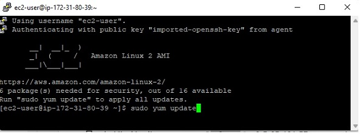

3. sudo yum update

4. Download and install Jenkins

    Add the Jenkins repo using the following command:
    sudo wget -O /etc/yum.repos.d/jenkins.repo <https://pkg.jenkins.io/redhat-stable/jenkins.repo>
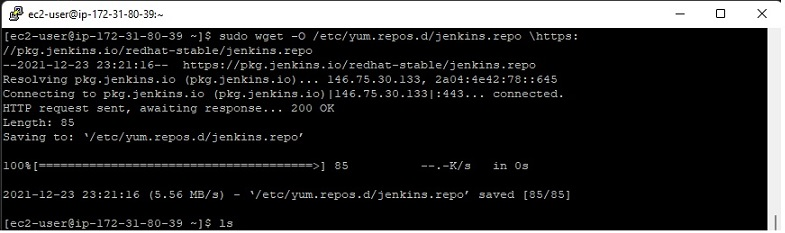

5. Import a key file from Jenkins-CI to enable installation from the package:
    sudo rpm --import <https://pkg.jenkins.io/redhat-stable/jenkins.io.key>
    - sudo yum upgrade
6. Install Jenkins using the following commands:
    1. sudo amazon-linux-extras install epel -y
    2. sudo yum update -y
    3. sudo yum install jenkins java-1.8.0-openjdk-devel -y
    4. sudo systemctl daemon-reload
7. Start Jenkins as a service:
      - sudo systemctl start jenkins
      - service jenkins start
8. You can check the status of the Jenkins service using the command:
      - sudo systemctl status jenkins

    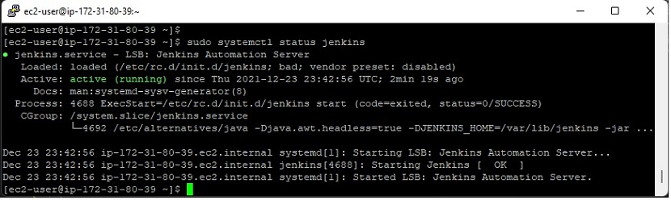
9. Configure Jenkins
    Jenkins is now installed and running on your EC2 instance. To configure Jenkins:
    1. Connect to <<<<<<<<<<<<<<<http://<your_server_public_DNS>:8080>>>>>>>>>>>>>>> from your browser. You will be able to access Jenkins through its management interface:
    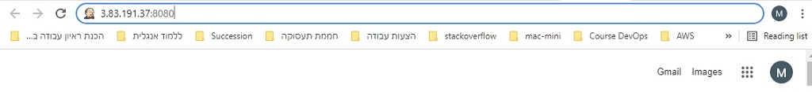
      It displays the below interface:
      
      - As prompted, enter the password found in /var/lib/jenkins/secrets/initialAdminPassword
      - Use the following command to display this password:
      - sudo cat /var/lib/jenkins/secrets/initialAdminPassword
      - The Jenkins installation script directs you to the Customize Jenkins page. Click Install suggested plugins.
      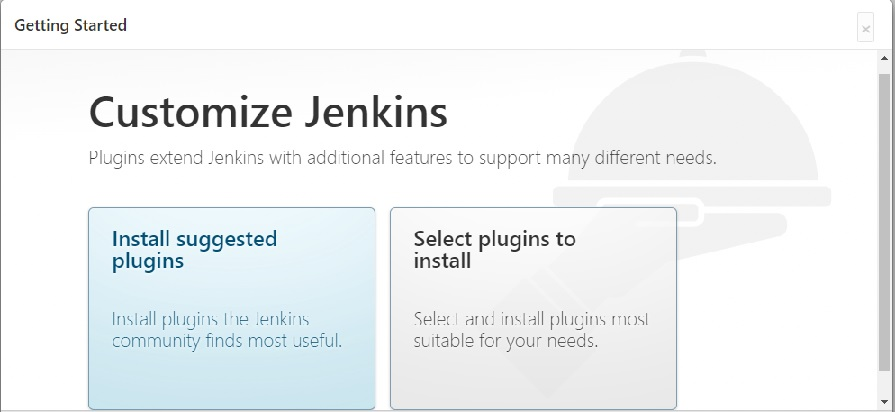
      - Once the installation is complete, Create First Admin User, click Save and Continue.
      
      - Instance Configuration
      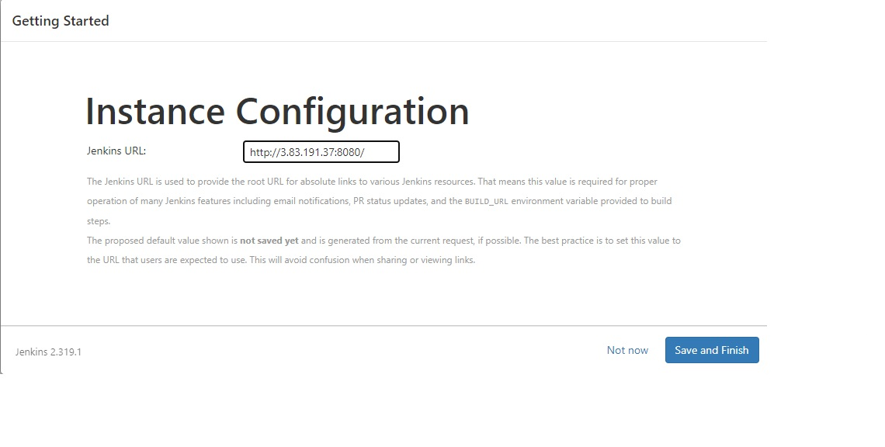
      - Jenkins is ready
      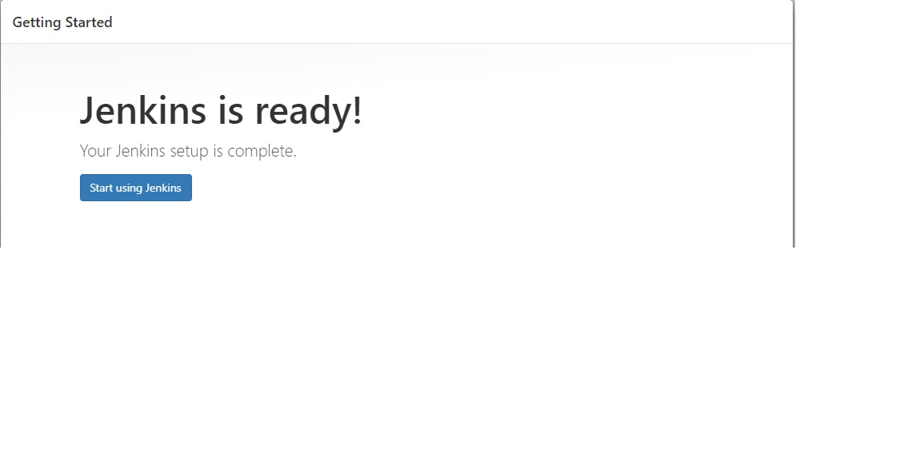
      - Welcome to Jenkins
      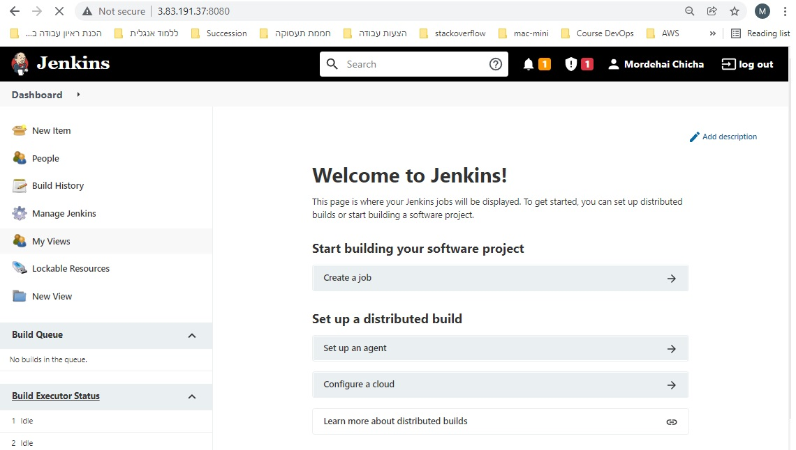

# B. Install & configure Maven build tool on Jenkins

## Install Maven on Jenkins

### 1. Creating maven directory under /opt

 mkdir /opt/maven
 cd /opt/maven
 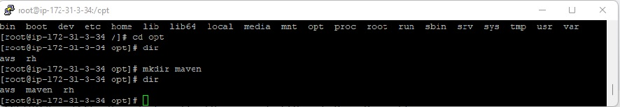

### 2. Download maven packages <https://maven.apache.org/download.cgi> onto Jenkins server. In this case, I am using /opt/maven as my installation directory

downloading maven version 3.8.4

wget <https://dlcdn.apache.org/maven/maven-3/3.8.4/binaries/apache-maven-3.8.4-bin.tar.gz>
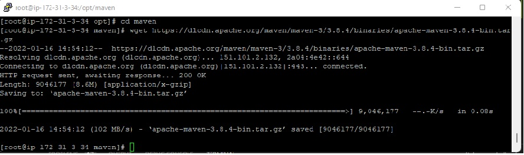

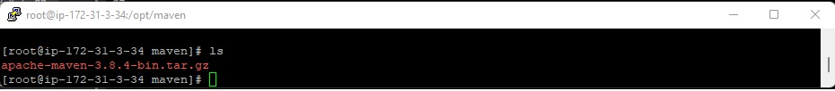

### 3. Extract the maven file

tar -xvzf apache-maven-3.8.4-bin.tar.gz
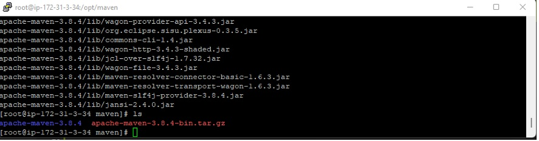

### 4. Setup M2_HOME and M2 paths in .bash_profile of the user and add these to the path variable

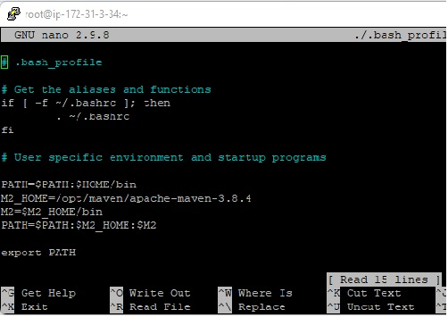

echo $PATH
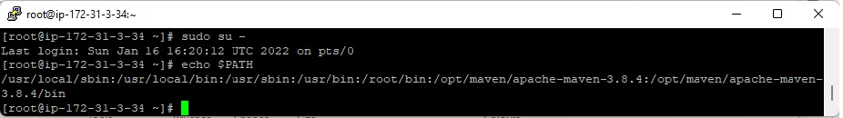

### 5. logoff and login to check maven version

mvn --version
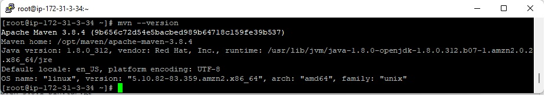

So far we have completed the installation of maven software to support maven plugin on the jenkins console. Let's jump onto Jenkins to complete the remaining steps.

### 6. Setup maven on Jenkins console

#### Install maven plugin without restart

- Manage Jenkins > Jenkins Plugins > available > Maven Invoker
- Manage Jenkins > Jenkins Plugins > available > Maven Integration
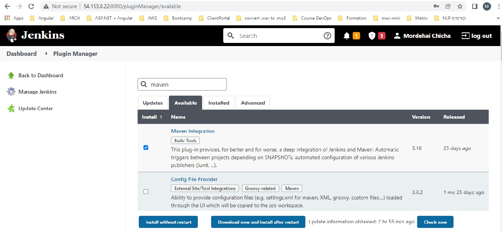

#### Configure maven path

### 7. Configure Git pulgin on Jenkins

#### Install Git on Jenkins server

yum install git -y

#### Setup Git on jenkins console

- Install git plugin without restart

  - Manage Jenkins > Jenkins Plugins > available > github

- Configure git path

  - Manage Jenkins > Global Tool Configuration > git

### Part-01 : Adding steps for Integration

### Steps to create Maven Jenkin job

1. Login to Jenkins console
2. Create *Jenkins job*, Fill the following details,
   - *Source Code Management:*
      - Repository: `https://github.com/mchicha/DevOps-Final-Project.git`
      - Branches to build : `*/master`
      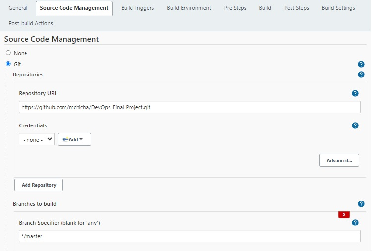
   - *Build:*
     - Root POM:`pom.xml`
     - Goals and options : `clean install package`
     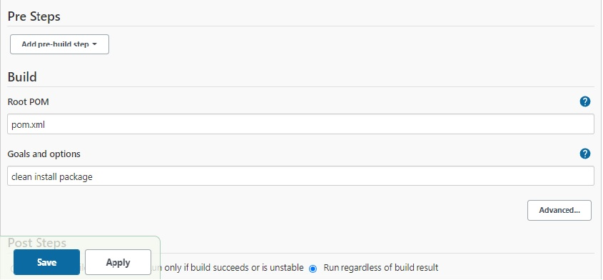
   - Console Output
     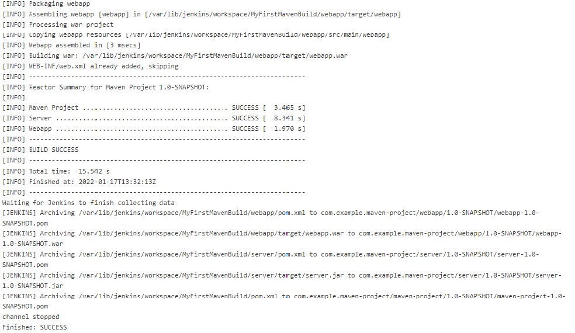

### Steps to create Pipeline Jenkin job

1. Login to Jenkins console
2. Create *Pipeline Jenkins job*, Fill the following details,

- *Pipeline*:
  - Pipeline script
  - Script:

```
    pipeline{
        agent any
        stages {
            stage("git"){
                steps{
                    git branch: 'master', url: 'https://github.com/mchicha/DevOps-Final-Project.git'
                }
            }
        }
    }

```

  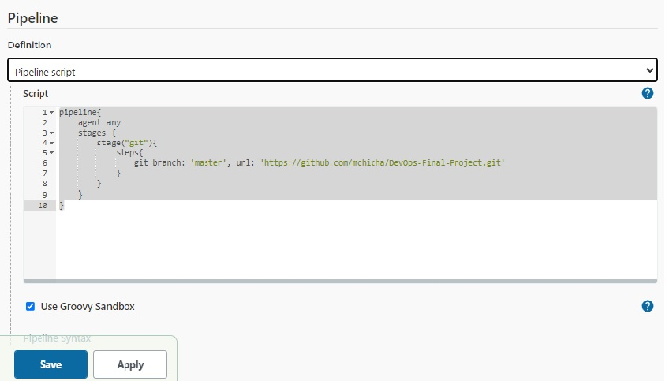

# C.Tomcat installation on EC2 instance

1. Launch Amazon Redhat ec2 Machine to install Apache
    Define Security Group (give internet access to connect to the server)

    HTTP 8080 ----> connect to the server via the web
  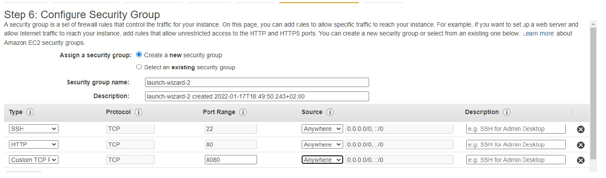

2. Connect to the Tomcat server via putty
  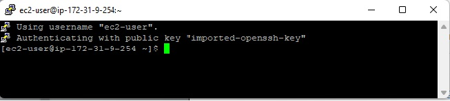

3. sudo su -

4. Install Java

    yum install java-1.8*

    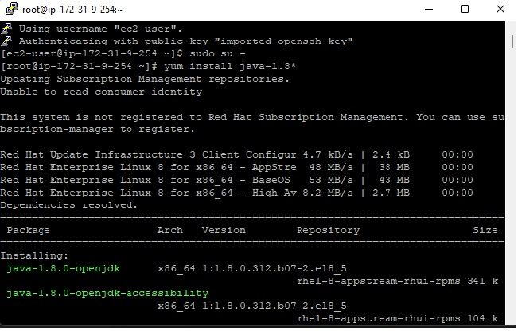

5. Check the java version

    java -version  
    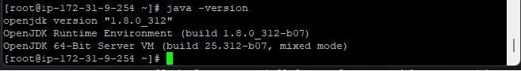

6. sudo yum update

7. Install wget

    sudo yum install wget

8. cd /opt

    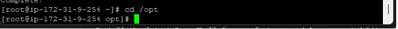

9. Download packages(find the packages to download by searching on google tomcat - download packages)

    Copy link address:
    wget <https://dlcdn.apache.org/tomcat/tomcat-10/v10.0.14/bin/apache-tomcat-10.0.14.tar.gz>

    

10. Open tar file

    tar -zvxf apache-tomcat-10.0.14.tar.gz
    
    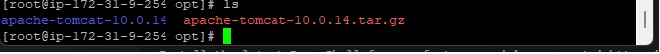

11. cd apache-tomcat-10.0.14

    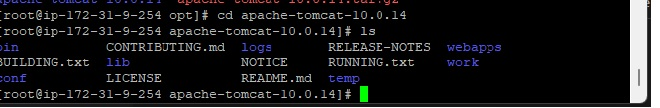

12. cd bin/

    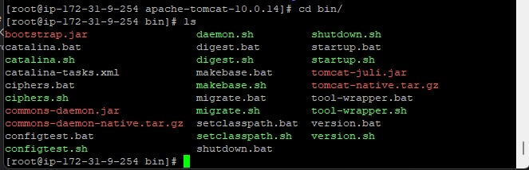

13. Give permission to run the startup.sh file

    chmod +x startup.sh

14. Give permission to run the shutdown.sh file

    chmod +x shutdown.sh

15. Create link files for tomcat startup.sh and shutdown.sh

    ln -s /opt/apache-tomcat-10.0.14/bin/startup.sh /usr/local/bin/tomcatup

    ln -s /opt/apache-tomcat-10.0.14/bin/shutdown.sh /usr/local/bin/tomcatdown
  
16. Run tomcatup

    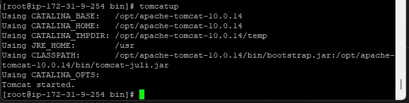

17. Access tomcat application from browser on port 8080

    <<http://<Public_IP>:8080>>

    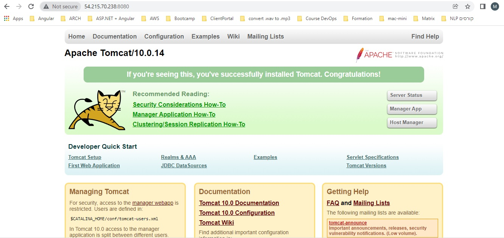

### Part-02: Adding Deployment Steps

### Jenkins server

1. sudo su -
2. cd /var/lib/jenkins
3. ls

    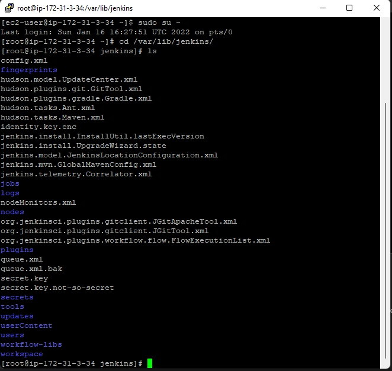

4. cd workspace

    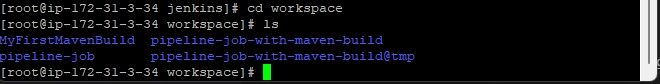

5. cd pipeline-job-with-maven-build

    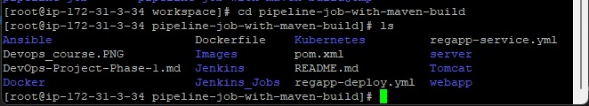

6. cd webapp

    

7. Install tree command

- sudo su -
- yum install tree

8. rum command tree

    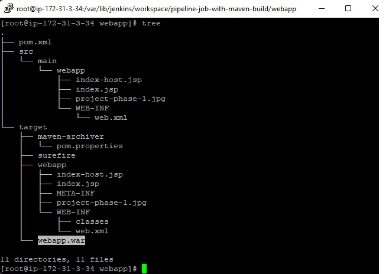

### Tomcat server

1. cd /opt
2. ls
3. cd apache-tomcat-10.0.14

    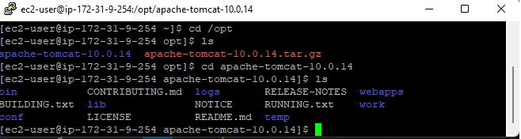

### Jenkins server

1. We have to install SSH Agent Plugin on Jenkins in order to transfer files from the jenkins server
to the tomcat server

   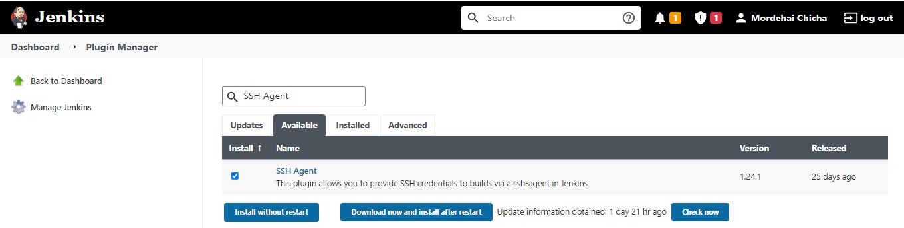

2. Write pipeline script with ssh agent to deploy on the tomcat server

    Here is the pipeline script from which we will add the deployment code:

```
    pipeline{
        agent any
        environment{
            PATH = "/opt/maven/apache-maven-3.8.4/bin:$PATH"
        }
        stages {
            stage("clone code"){
                steps{
                    git branch: 'phase-1-deploy-on-ec2', url: 'https://github.com/mchicha/DevOps-Final-Project.git'
                }
            }
            stage("build code"){
                steps{
                    sh "mvn clean install"
                }
            }
        }
    }

```

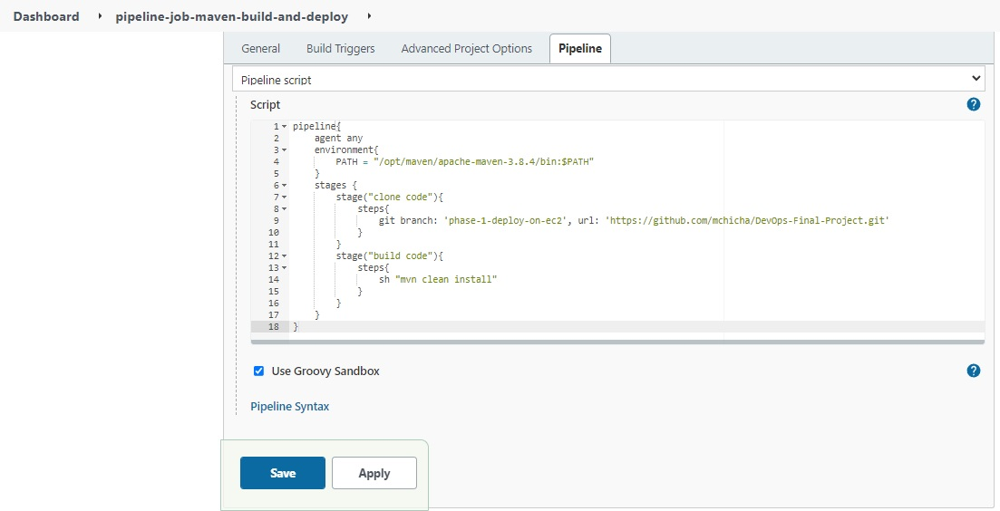

3. Click Pipeline Synthax
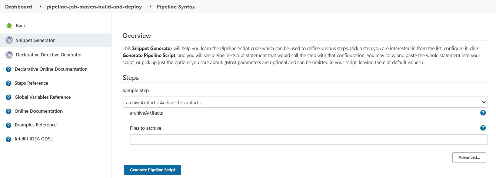

4. Choose in the Sample Step: SSH Agent
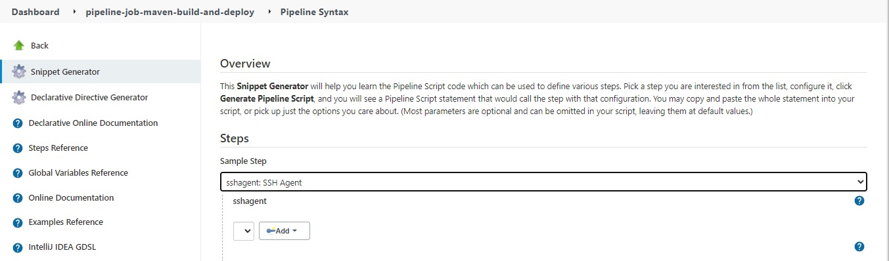

5. Click Add Jenkins Credentials

    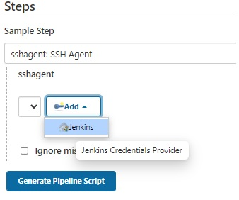

6. It displays a Jenkins Credentials Provider window
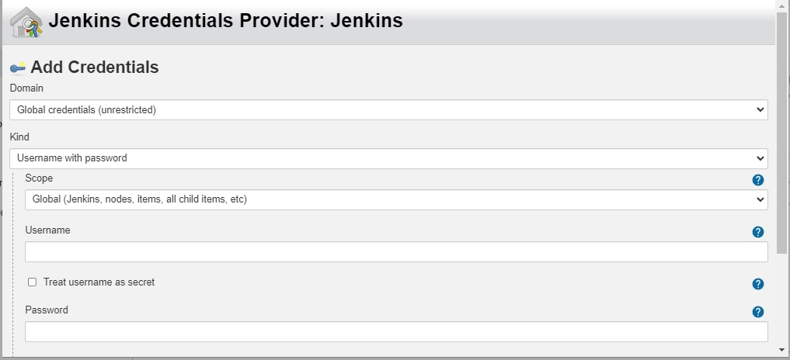

7. Fill the data
   - For Kind: Choose SSH Username with private key
   - For ID: Enter deploy_user
   - For Description: Enter deploy_user
   - For Username: Enter ec2-user
   - For Private Key: Selected Enter directly
   - Click the Add Button and paste the tomcat-server.pem key
   - Click the Add button on the left bottom of the window

    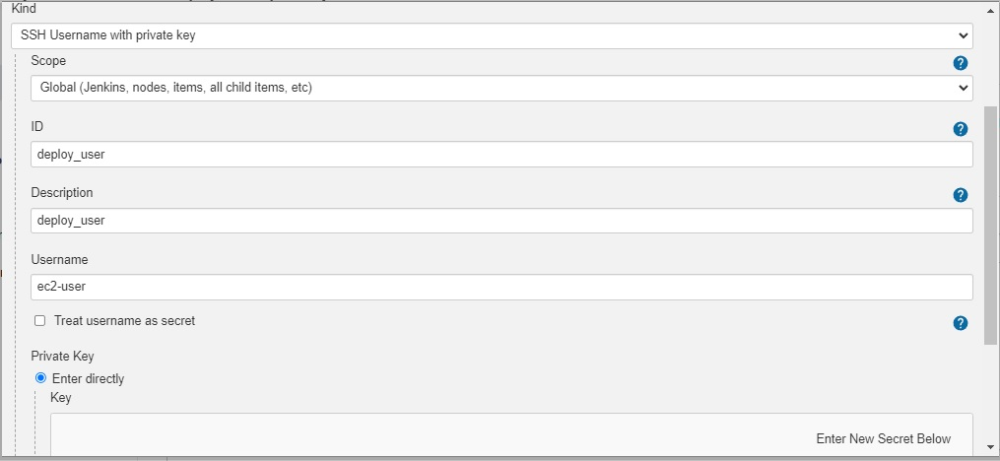

8. Choose ec2-user(deploy_user)

    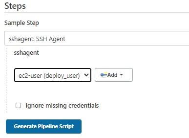

9. Click on the Generate Pipeline Script

    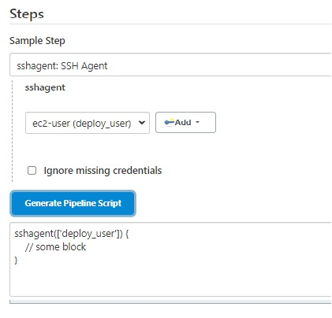

10. Copy the sshagent script to the pipeline script adding a stage:

  ```
  sshagent(['deploy_user']) {
      // some block
  }
  ```  
  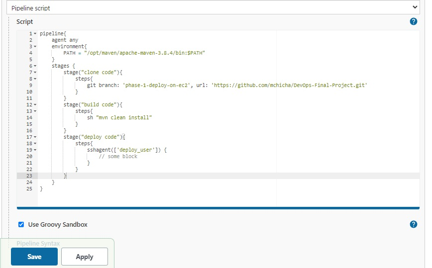

11. Add in the sshagent segment the command scp to copy the webapp.war file from the jenkins server to the tomcat server

    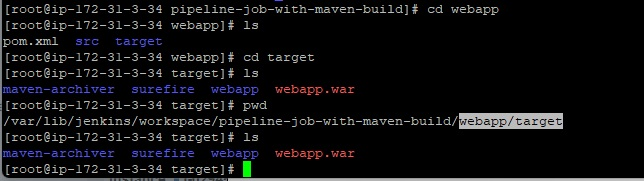

  - Here is the synthax of the scp command:

    scp <src_file> username@IP:<dest_path>
    
    where IP is the IP of the tomcat server
    
    and <dest_path> is /opt/apache-tomcat-10.0.14/webapps

    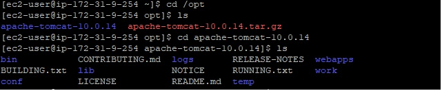

    scp webapp/target/webapp.war ec2-user@54.215.70.238:/opt/apache-tomcat-10.0.14/webapps

12. Finally add the next command to the pipeline script:

    sh "scp webapp/target/webapp.war ec2-user@54.215.70.238:/opt/apache-tomcat-10.0.14/webapps"

    sh for shell command

13. Add the attribute StrictHostKeyChecking=no in the scp command:

    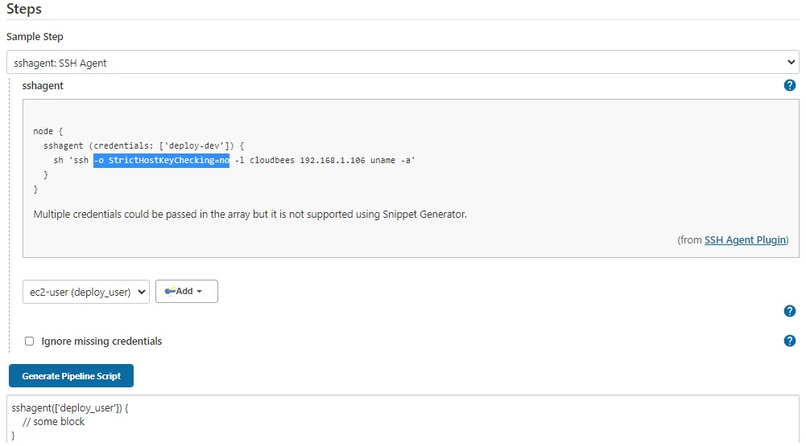

    sh "scp -o StrictHostKeyChecking=no webapp/target/webapp.war ec2-user@54.215.70.238:/opt/apache-tomcat-10.0.14/webapps"

14. Change the owner and group permissions of the /opt directory and sub-directories of the tomcat server to ec2-user

  - sudo chown -R ec2-user:ec2-user /opt

    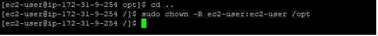

15. Finally pipeline script

```
  pipeline{
      agent any
      environment{
          PATH = "/opt/maven/apache-maven-3.8.4/bin:$PATH"
      }
      stages {
          stage("clone code"){
              steps{
                  git branch: 'phase-1-deploy-on-ec2', url: 'https://github.com/mchicha/DevOps-Final-Project.git'
              }
          }
          stage("build code"){
              steps{
                  sh "mvn clean install"
              }
          }
          stage("deploy code"){
              steps{
                  sshagent(['deploy_user']) {
                      sh "scp -o StrictHostKeyChecking=no webapp/target/webapp.war ec2-user@54.215.70.238:/opt/apache-tomcat-10.0.14/webapps"
                  }
              }
          }
      }
  }

```
  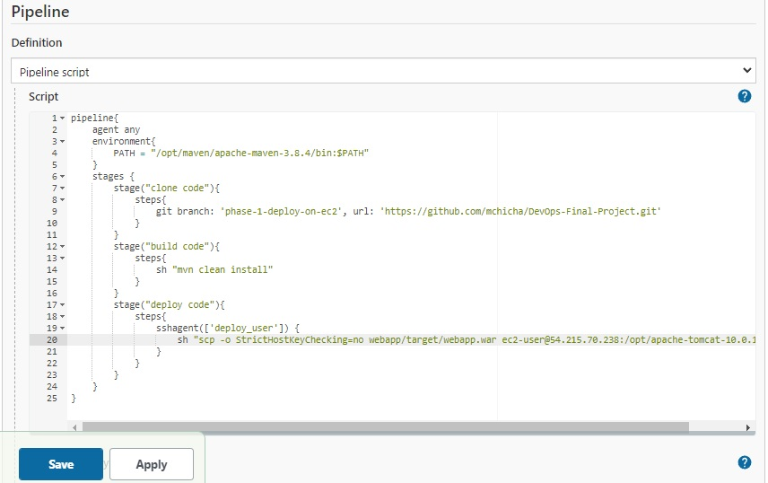

16. Run the pipeline job on the jenkins server
  
  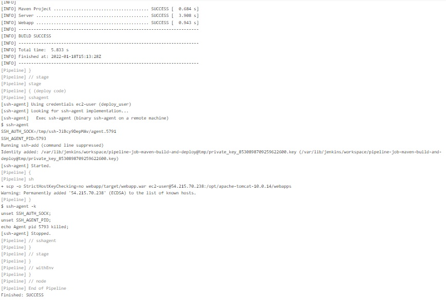

17. Browser on the tomcat server
  
  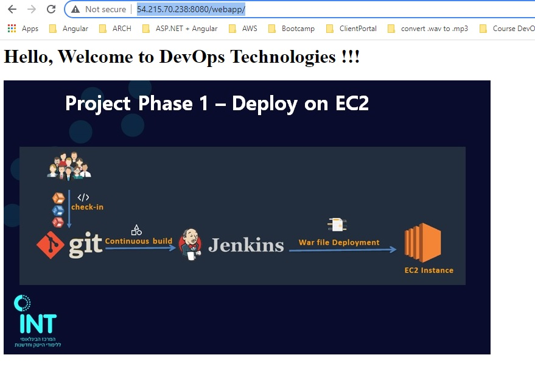

18. Browser on the tomcat server after doing changes in the index.jsp file of the the webapp

  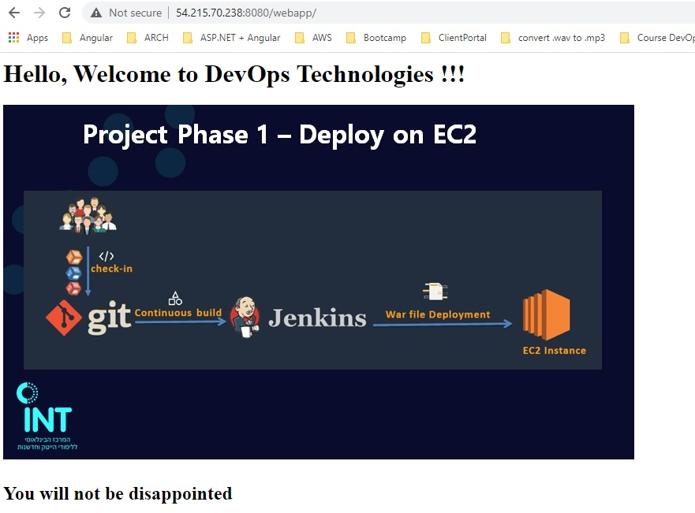


### Part-03 : Continuous Integration & Continuous Deployment (CI/CD)

Now job is running fine but to make this as Continuous Integration and Continuous Deployment Tod do that go back and modify job as below.

- Build Triggers
  - Poll SCM
    - schedule `*/2 * * * *`

Save the job and modify the code in GitHub. Then you could see your job get trigger a build without any manual intervention.
