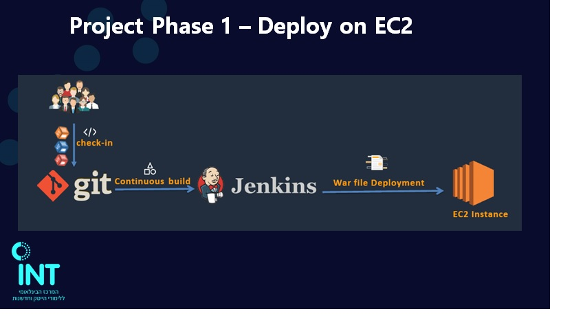
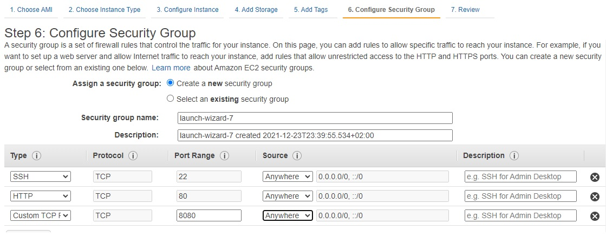
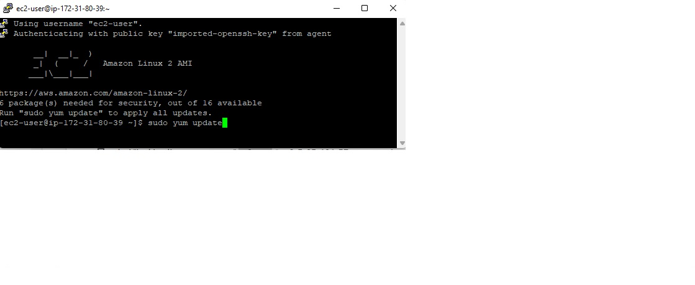
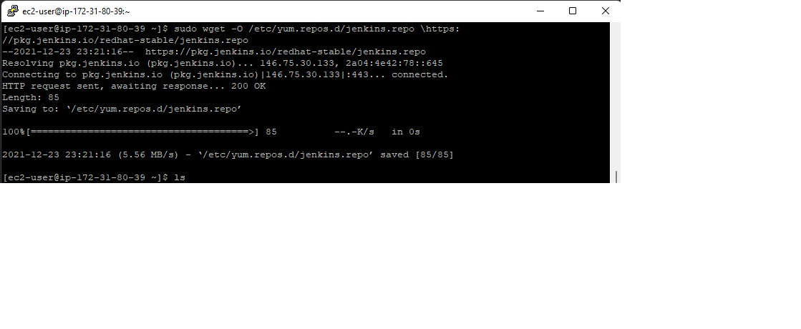
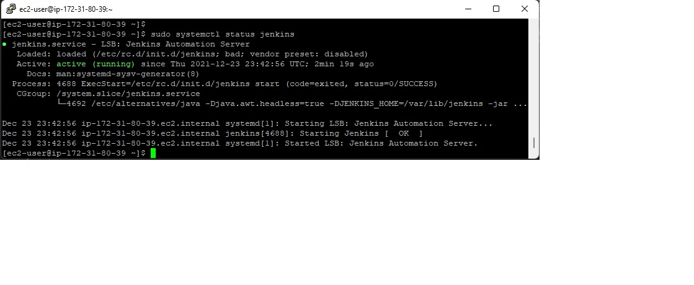
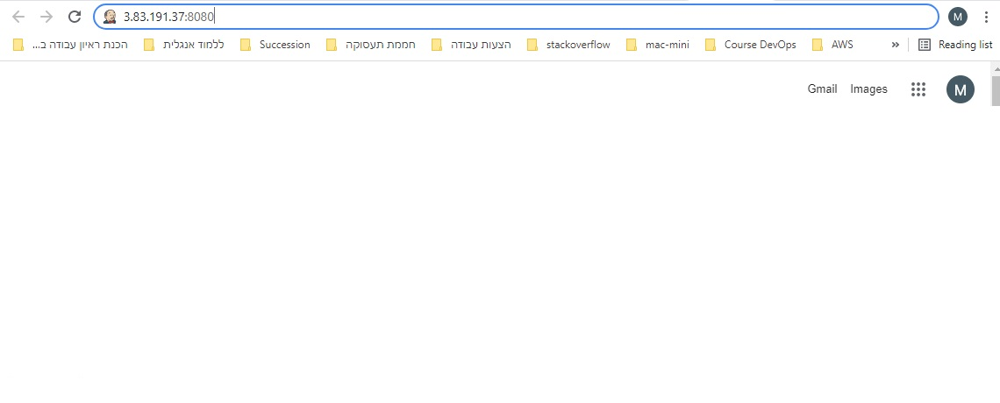
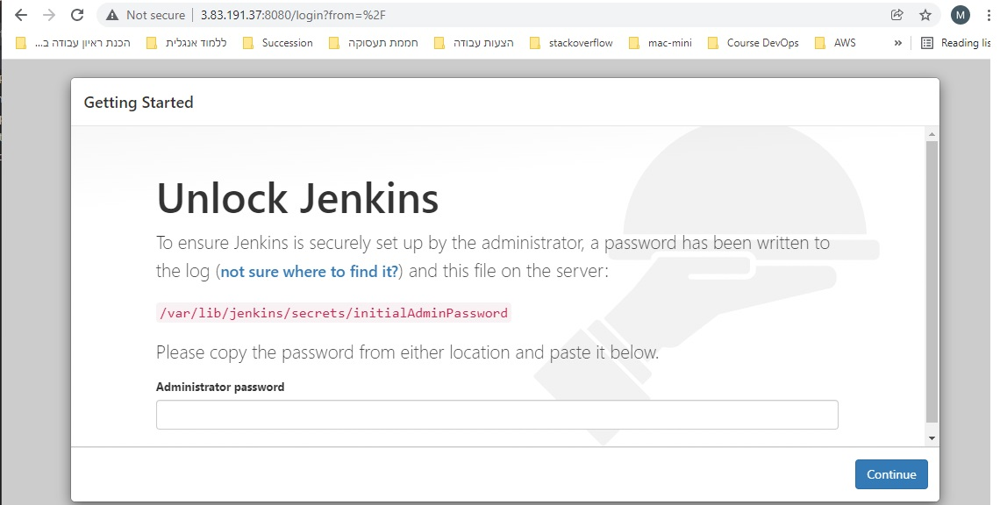

# DevOps Project Phase 1 - Deploy on EC2 

We know how to use work with each and Git, Jenkins independently. What if you want to collaborate these two? that is where Simple DevOps project helps you. Follow below steps if you are a new guy to DevOps. You love it. 

### Follow this article in **[YouTube](https://www.youtube.com/watch?v=Z9G5stlXoyg)**  
1. Launch Amazon Linux
   - With internet access
   - Security Group with Port '8080' open for internet

2. connect to the Amazon Linux ec2 machine via putty

3. sudo yum update
4. Download and install Jenkins
    - Add the Jenkins repo using the following command:
    sudo wget -O /etc/yum.repos.d/jenkins.repo \https://pkg.jenkins.io/redhat-stable/jenkins.repo
    
5. Import a key file from Jenkins-CI to enable installation from the package:
    sudo rpm --import https://pkg.jenkins.io/redhat-stable/jenkins.io.key
    - sudo yum upgrade
6. Install Jenkins using the following commands:
    1. sudo amazon-linux-extras install epel -y
    2. sudo yum update -y
    3. sudo yum install jenkins java-1.8.0-openjdk-devel -y
    4. sudo systemctl daemon-reload
7. Start Jenkins as a service:
      - sudo systemctl start jenkins
8. You can check the status of the Jenkins service using the command: 
      - sudo systemctl status jenkins
      
9. Configure Jenkins
    Jenkins is now installed and running on your EC2 instance. To configure Jenkins:
      1. Connect to http://<your_server_public_DNS>:8080 from your browser. You will be able to access Jenkins through its management interface:
      
      It displays the below interface:
      
      - As prompted, enter the password found in /var/lib/jenkins/secrets/initialAdminPassword
      - Use the following command to display this password:
      - sudo cat /var/lib/jenkins/secrets/initialAdminPassword
      - The Jenkins installation script directs you to the Customize Jenkins page. Click Install suggested plugins.
      - Once the installation is complete, Create First Admin User, click Save and Continue.
      
      
      
      

1. Jenkins server **[Get Help here](https://www.youtube.com/watch?v=M32O4Yv0ANc)

### Part-01 : Adding steps for Integration
### Steps to create Jenkin job
1. Login to Jenkins console
1. Create *Jenkins job*, Fill the following details,
   - *Source Code Management:*
      - Repository: `https://github.com/ValaxyTech/hello-world.git`
      - Branches to build : `*/master`  
   - *Build:*
     - Root POM:`pom.xml`
     - Goals and options : `clean install package`

### Part-02: Adding Deployment Steps 
in this port we are going to install 'deploy to container' plugin. this is need to deploy on tomcat server which we are using. 

- Install maven plugin without restart  
  - `Manage Jenkins` > `Jenkins Plugins` > `available` > `deploy to container`
 
To deploy our build artifacts on tomcat server our Jenkins server need access. For this we should setup credentials. This option is available in Jenkins home page

- setup credentials
  - `credentials` > `jenkins` > `Global credentials` > `add credentials`
    - Username	: `deployer`
    - Password : `XXXXXXX`
    - id      :  `Tomcat_user`
    - Description: `Tomcat user to deploy on tomcat server`

Modify the same job which created in part-01 and add deployment steps.
 - Post Steps
   - Deploy war/ear to container
      - WAR/EAR files : `**/*.war`
      - Containers : `Tomcat 8.x`
         - Credentials: `Tomcat_user` (which created in above step)
         - Tomcat URL : `http://<PUBLIC_IP>:<PORT_NO>`

Save and run the job now.

### Port-03 : Continuous Integration & Continuous Deployment (CI/CD)
Now job is running fine but to make this as Continuous Integration and Continuous Deployment Tod do that go back and modify job as below. 
  - Build Triggers
    - Poll SCM
      - schedule `*/2 * * * *`

Save the job and modify the code in GitHub. Then you could see your job get trigger a build without any manual intervention.
