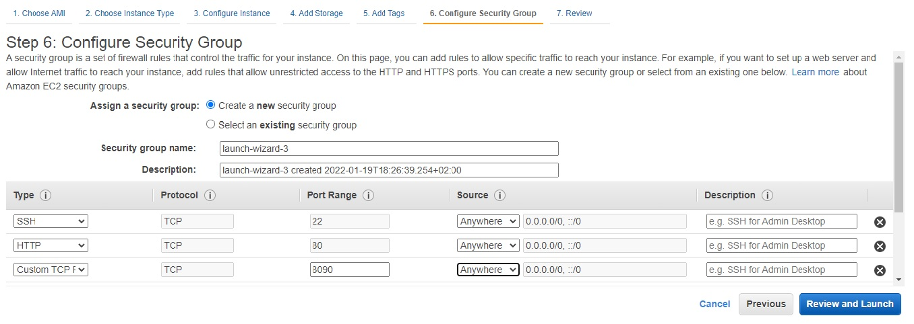
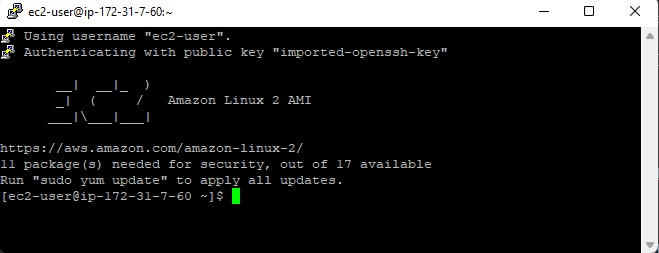
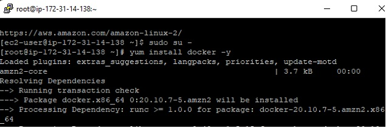
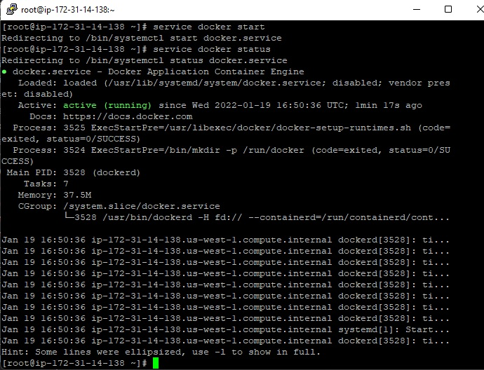
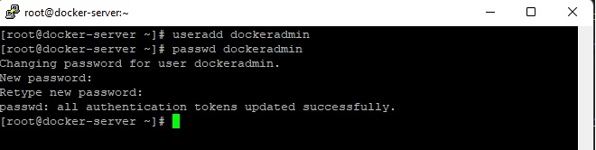
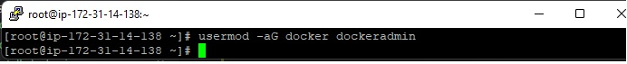
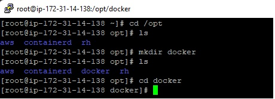
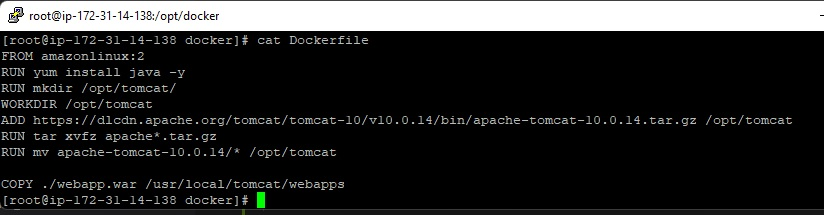

# DevOps Project Phase 2 - Deploy on Docker

  

1. Launch an EC2 instance for Docker server
   
   With internet access

   Security Group with Port '8090' open for internet
   

2. connect to the Docker server(Amazon Linux ec2 machine) via putty

    

3. Install docker on EC2 instance
    - sudo su -
    - yum install docker -y

    

    - docker --version

    

4. Start docker services
    - service docker start
    - service docker status

    

5. Create a user called dockeradmin
    - useradd dockeradmin
    - passwd dockeradmin

    

6. Add a user to docker group to manage docker
    - usermod -aG docker dockeradmin

    

7. Write the Dockerfile file under /opt/docker
    - cd /opt
    - mkdir docker

    

8. Create a Dockerfile file

    ```
        FROM amazonlinux:2
        RUN yum install java -y
        RUN mkdir /opt/tomcat/
        WORKDIR /opt/tomcat
        ADD https://dlcdn.apache.org/tomcat/tomcat-10/v10.0.14/bin/apache-tomcat-10.0.14.tar.gz /opt/tomcat
        RUN tar xvfz apache*.tar.gz
        RUN mv apache-tomcat-10.0.14/* /opt/tomcat

        COPY ./webapp.war /usr/local/tomcat/webapps

    ```
    

9. Login to Jenkins Console and add Docker server to execute commands from Jenkins
    - Manage Jenkins --> Configure system --> Publish over SSH --> add Docker server and credentials