# DevOps Project Phase 2 - Deploy on Docker

  

1. Launch an EC2 instance for Docker server
   
   With internet access

   Security Group with Port '8080' open for internet
   

2. Connect to the Docker server(Amazon Linux ec2 machine) via putty

    

3. Chnage hostname of the ec2 machine to docker-server
    - sudo su -
    - hostname docker-server
    - sudo su -

    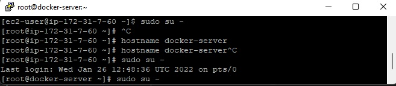
    
4. Install docker on EC2 instance
    - yum install docker -y

    

    - docker --version

    

5. Start docker services
    - service docker start
    - service docker status

    

6. Create a user called dockeradmin
    - useradd dockeradmin
    - passwd dockeradmin

    

7. Add a user to docker group to manage docker
    - usermod -aG docker dockeradmin

    

8. Write the Dockerfile file under /home/dockeradmin
    - cd /home
    - ls
    - cd dockeradmin


    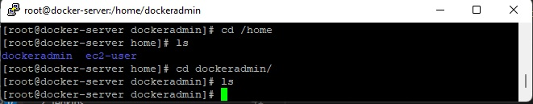

9. Create a Dockerfile file
    - sudo nano Dockerfile
    ```
        # Pull tomcat image
        FROM tomcat:8.0

        # Copy webapp.war to tomcat
        COPY ./webapp.war /usr/local//tomcat/webapps
        
    ```
    

10. Login to Jenkins Console and add Docker server to execute commands from Jenkins
    - Manage Jenkins --> Configure system --> Publish over SSH --> add Docker server and credentials
    - Set for Name: docker-server
    - Set for Hostname: Private IP of the docker-server
    - Set for Username: dockeradmin
    - Set for Password: *******

    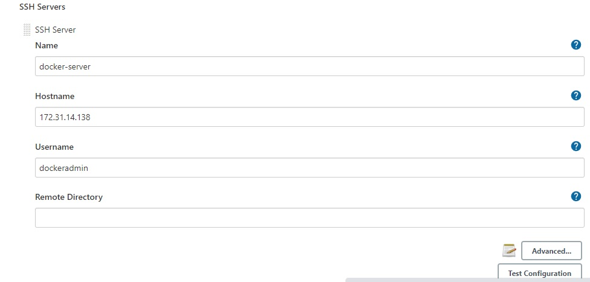

11. Edit the sshd_config file
    - sudo su -
    - nano /etc/ssh/sshd_config
    - set PasswordAuthentication yes

    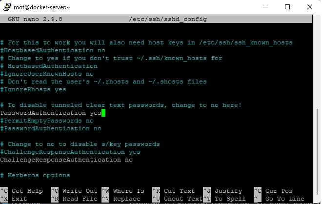

    - Run command: service sshd restart
    
    or 

    - Run command: service sshd reload

    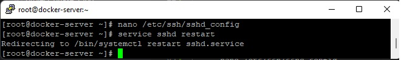

12. Create a new job: deploy-on-docker
    ### Part: Source code Management
    - Repository URL: https://github.com/mchicha/DevOps-Final-Project.git
    - Branch Specifier (blank for 'any'): */phase-2-deploy-on-docker

    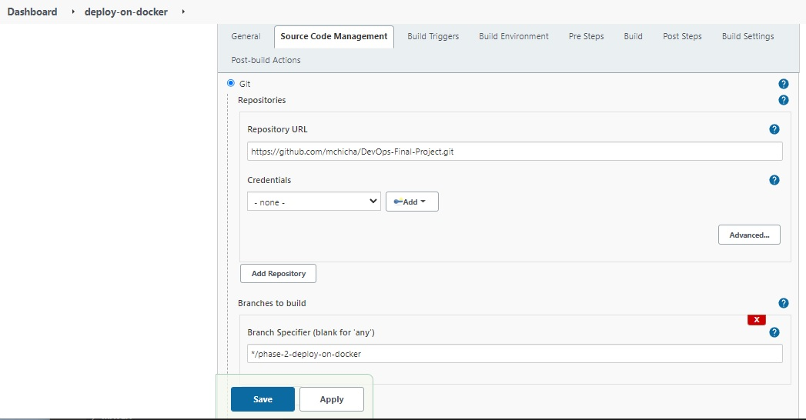

    ### Part: Build
    - Root POM: pom.xml
    - Goals and options: clean install package

    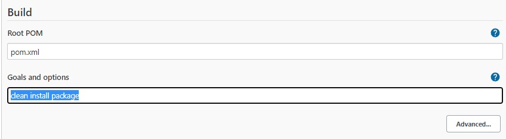

    ### Post build step
    - Click on Add post build step
    - Select: Send files or execute commands over SSH
    - Set for Name: docker-server
    - Set for Source files: webapp/target/*.war
    - Set for Remove prefix: webapp/target
    - Set for Remote directory: .
    - Exec command: 
```
        docker stop tomcat-server-ctr;
        docker rm -f tomcat-server-ctr;
        docker rmi -f tomcat-server-v8;
        docker build -t tomcat-server-v8 -f Dockerfile . ;
        docker run -d --name tomcat-server-ctr -p 8080:8080 tomcat-server-v8

```
    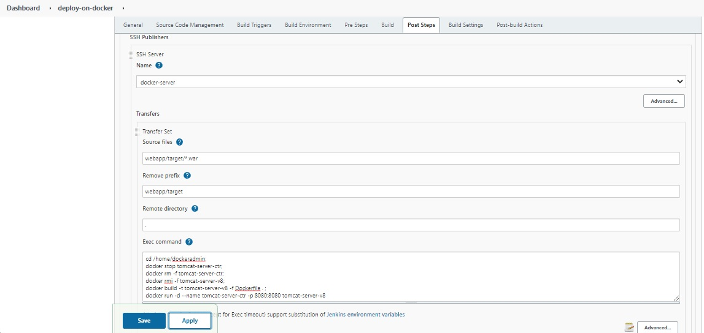

13. Check on the docker-server
    - cd /home/dockeradmin
    - docker images
    - docker ps

    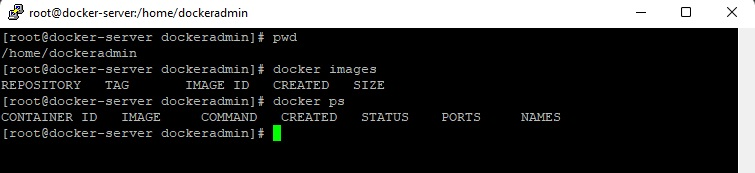

14. Build the job: Deploy-on-docker
    - Error when build job: ERROR: Exception when publishing, exception message [Permission denied]

    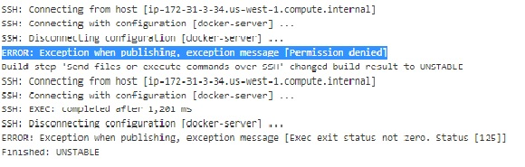

15. Solution: chown -R dockeradmin:dockeradmin /home/dockeradmin

    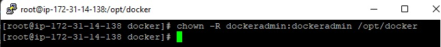

16. Build again the job: Deploy-on-docker
    ### Console output

    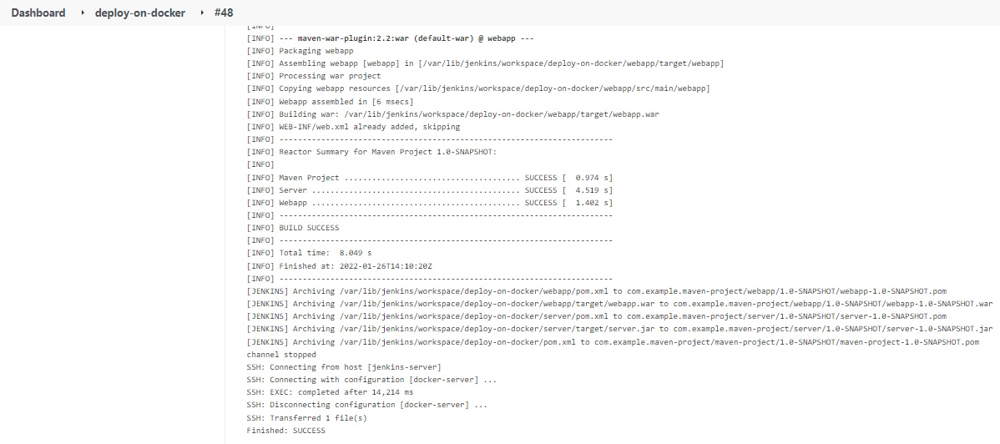

17. Browser on the docker-server
    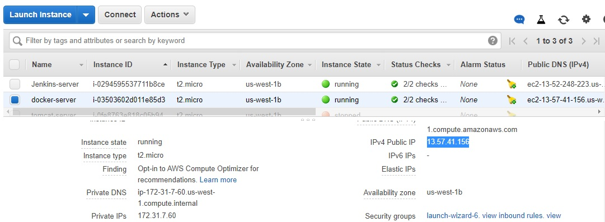

    - Public IP: 13.57.41.156
    - Port: 8080

    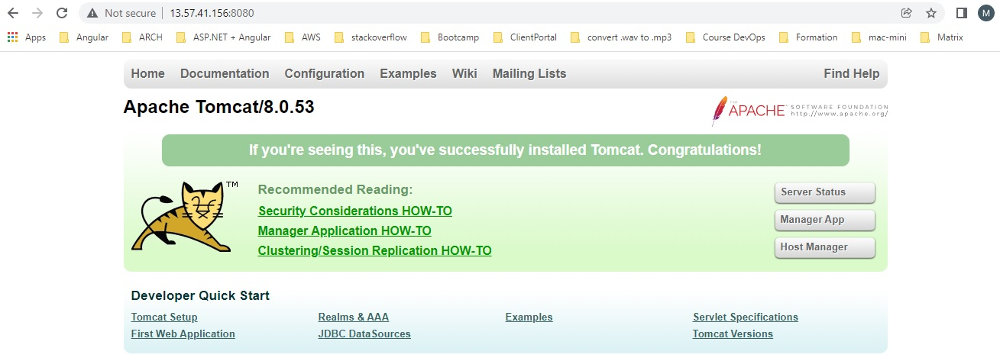

    - browse webapp: 13.57.41.156:8080/webapp

    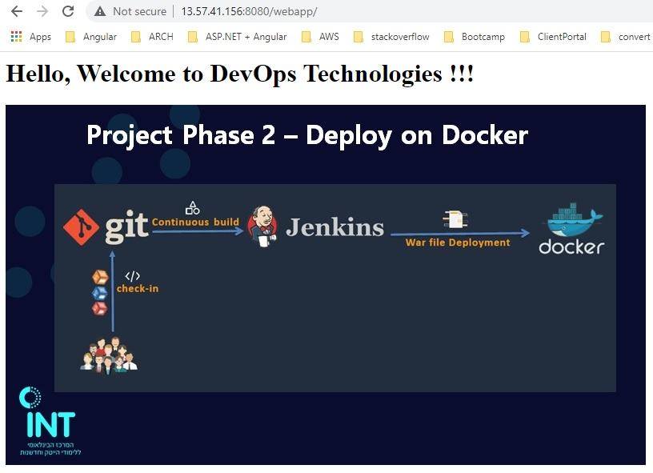