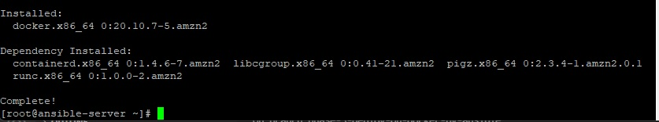

# DevOps Project Phase 3 - Deploy on Docker by Ansible

  

1. Launch an EC2 instance for Ansible server
    uses Amazon Linux 2 AMI as for the Jenkins server and the docker server

    

    With internet access

    Security Group with Port '8080' open for internet
    

    AWS EC2 Dashboard

    

 2. Connect to the docker-server via Putty
    
    Change hostname of the ec2 machine to docker-server:
    - sudo su -
    - hostname docker-server
    - sudo su -

    

3. Run command: docker ps

   

4. Start docker services
    - service docker start
    - service docker status

    

5. Connect to the ansible-server via Putty
    
   Change hostname of the ec2 machine to ansible-server:
    - sudo su -
    - hostname ansible-server
    - sudo su -

    

6. Ansible Installation on the ansible-server

    a. Install python and python-pip

        . yum install python
        . python --version

    

        . yum install python-pip

    

    b. Install ansible using pip check for version

        . pip install ansible

    

    

        . ansible --version

    

    c. Create a new directory inside /etc/

        . mkdir /etc/ansible
    
    d. Create a user called ansadmin (on Control node and Managed host)

        . useradd ansadmin
        . passwd ansadmin

     

    e. Below command grant sudo access to ansadmin user. But we strongly recommended using "visudo" command if you are aware vi or nano editor. (on Control node and Managed host)

        . visudo

        echo "ansadmin ALL=(ALL) NOPASSWD: ALL" >> /etc/sudoers

    f. Ansible server used to create images and store on docker registry. Hence install docker, start docker services and add ansadmin to the docker group.

        . yum install docker

     

     

    g. Start docker services

        . service docker start
        . service docker status

     

    h. Add user to docker group
        
        . usermod -aG docker ansadmin

    

    i. Edit the sshd_config file as we have done in the docker-server

        . nano /etc/ssh/sshd_config
        . set PasswordAuthentication yes
        
    

    j. Run the next command in order that the changes in the sshd_config file will work:
        . service sshd reload
    

    k. Log in as a ansadmin user on master and generate ssh key (on Control node)

        . sudo su - ansadmin

    

    l. Generate ssh key

        . ssh-keygen

    

    m. Run the next command:
       
        . ls -la
        . cd .ssh/
        . ls
    

        id_rsa is the private key(if we share the private key, anyone will able to access our system)
        id-rsa.pub is the public key

        we are going to share only the public key and not the private key

        We create the keys to interact to build our connections with the docker-server. And for this we required a user that's why we created a user and we are going to share the public key to the docker-server. So we have the integration things. Now we have the setup for the ansible.

    n. Run the next command

        . exit
    

7. Create the user ansadmin on the docker-server
    
        . sudo su -
        . useradd ansadmin
        . passwd ansadmin

    

8. On the Ansible-server, login to the ansadmin user
        
        . su - ansadmin

9. Copy keys onto all ansible managed hosts (on Control node)

        . ssh-copy-id ansadmin@<target-server>

        where <target-server> is the Private IP of the docker-server

        Private IP = 172.31.7.60
        
        Run the next command:
        . ssh-copy-id ansadmin@172.31.7.60  
        
      

10. Connect to the docker-server from the Ansible-server via ssh

        . ssh ansadmin<target-server>

        where <target-server> is the Private IP of the docker-server

        Private IP = 172.31.7.60

        Run the next command:
        . ssh ansadmin@172.31.7.60

    

11. Run the exit command from the Ansible-server:
        
        . exit
    
    

12. Logout from ansadmin user on the Ansible-server

        . pwd
        . ls
        . exit

    
           
13. Validation test(check the ping request)

    a. Create an inventory file called "hosts" in the /etc/ansible directory add control node IP address in it.

        . cd /etc/ansible
        . ls
        . nano hosts(if it not existed)
        . Add the Private IP of the docker-server
        . Add localhost

    

    b. Login to the ansadmin user on the Ansible-server

        . su - ansadmin

    

    c. Run ansible command as ansadmin user it should be successful (Master)

        . ansible all -m ping

    

    The local host failed because we have to add the key for the local system because we already added the key for the remote target machine that is the talker host

    d. Run the next command:

        . ssh-copy-id localhost

    

    e. Run again the next command:

        . ansible all -m ping

    

    Ansible is now able to talk with the docker-server
        