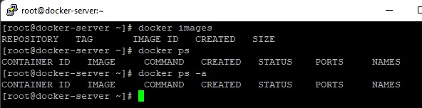
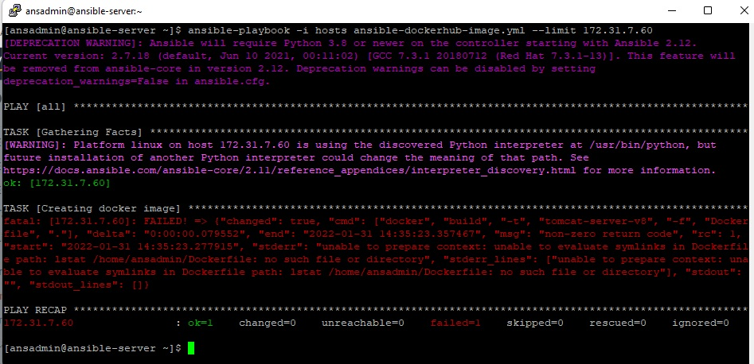

# DevOps Project Phase 4 - Ansible Deploy to DockerHub 

  

1. Connect to the ansible-server via Putty

        . su - ansadmin
        . ls
    

2. View the content of the ansible-docker-image.yml

        ---
        - hosts: all
        become: true

        tasks:
        - name: Stop container
            command: docker stop name tomcat-server-ctr
            ignore_errors: yes

        - name: Remove container
            command: docker rm tomcat-server-ctr
            ignore_errors: yes

        - name: Remove docker image
            command: docker rmi tomcat-server-v8
            ignore_errors: yes

        - name: building docker image using war file
            command: docker build -t tomcat-server-v8 -f Dockerfile .
            args:
            chdir: /home/ansadmin

        - name: building docker container out of image
            command: docker run -d --name tomcat-server-ctr -p 8080:8080 tomcat-server-v

3. Check if the service docker running

        . service docker status
    

4. Check if existing docker containers and docker images

    . docker ps
    . docker images

    If it exists docker containers and docker images, so remove them.
    

5. Run the ansible-docker-image.yml file with ansible-playbook locally(localhost)

        . ansible-playbook -i hosts ansible-docker-image.yml
    
    

6. Check if existing docker containers and docker images

        . docker ps
        . docker images
    

7. Now we want to push the image to the docker hub account and we need to tag our image with the prefix of our account
    Tagging an image is very important otherwise the docker hub will not understand from which particaular account, the particular image has to move.
    So we will now tag the image
        . docker tag tomcat-server-v8 mordehaic/tomcat-server-v8
        . docker images
    

    Now we have another image and this a the base image on which we have a customized image

8. Now, i will push this base image to the docker hub
        
        . docker push mordehaic/tomcat-server-v8
    

        we got the next message: requested access to the resource is denied
        We have to login to the docker hub

9. Login to docker hub
        
        . docker login
    

10. Push a new time the base image to the docker hub
        
        . docker push mordehaic/tomcat-server-v8
    

        The push image succeeded
11. Check on the docker hub that the image existed
    

12. Command to push a new tag to this repository with the image we push on the docker hub
        . docker push mordehaic/tomcat-server-v8:tagname
    

13. Connect to the docker-server
    
    Run the service docker

        . service docker start
        . service docker status
    

14. Check on the docker-server if existing images and containers

        . docker images
        . docker ps
        . docker ps -a
    

15. On the ansible-server, remove also the mordehaic/tag image if existing

        . docker rmi mordehaic/tomcat-server-v8
    

16. Pull the tag image from the docker hub on the ansible-server

        . docker pull mordehaic/tomcat-server-v8
    

17. On the docker-server, switch to the ansadmin user because we will do all with this user

        . su - ansadmin
    

18. Let 's check if the id belong to the docker group

        . id
        . exit
        . usermod -aG docker ansadmin(add the user to the docker group)
        . id
    

19. Pull the mordehaic/tomcat-server-v8 image on the docker-server
        
        . docker pull mordehaic/tomcat-server-v8
        . docker images
    

    So we succeeded to push the image to the docker hub and pull it to the both server: ansible-aerver and docker-server

20. Create a new ansible playbook: "ansible-dockerhub-image.yml" to create an image and push onto the docker hub
    
        ---
        - hosts: all
        become: true

        tasks:
        - name: Creating docker image
            command: docker build -t tomcat-server-v8 -f Dockerfile .
            args:
            chdir: /home/ansadmin

        - name: Adding tag to image
            command: docker tag tomcat-server-v8 mordehaic/tomcat-server-v8

        - name: Push image to dockerhub
            command: docker push mordehaic/tomcat-server-v8

        - name: Remove images from local
            command: docker rmi tomcat-server-v8 mordehaic/tomcat-server-v8
            ignore_errors: yes
    

21. Login to docker on the ansible-server

        . docker login
    

22. Check if existing docker containers. If existing so remove them.

        . docker ps
        . docker stop tomcat-server-ctr
        . docker rm tomcat-server-ctr
        . docker ps
        . docker ps -a
    

23. Check if existing docker images. If existing so remove them

        . docker images
        . docker rmi tomcat-server-v8
        . docker rmi mordehaic/tomcat-server-v8
        . docker images
    

24. Run with ansible-playbook the "ansible-dockerhub-image.yml" file

        . ansible-playbook -i hosts ansible-dockerhub-image.yml
    

    The image was pushed to the docker hub

    

25. We will create a new file that will be run with ansible-playbook to the deployment of the conatiner: "ansible-container-deployment.yml"

        ---
        - hosts: all
        #become: true

        tasks:
        - name: Stop container
            command: docker stop tomcat-server-ctr
            ignore_errors: yes

        - name: Remove container
            command: docker rm tomcat-server-ctr
            ignore_errors: yes

        - name: Remove docker image
            command: docker rmi mordehaic/tomcat-server-v8
            ignore_errors: yes

        - name: Pulling image from dockerhub
            command: docker pull mordehaic/tomcat-server-v8:latest

        - name: Building docker container from from the docker image pulled from dockerhub
            command: docker run -d --name tomcat-server-ctr -p 8080:8080 mordehaic/tomcat-server-v8

26. Run with ansible-playbook the "ansible-container-deployment.yml" file

        . ansible-playbook -i hosts ansible-container-deployment.yml
    

27. Check if the container was created

        . docker ps
        . docker images
    

    We can see that the container was created and the image was pulled from docker hub

28. We have to add the private ip of the docker-server on the "hosts" file to create the container on the docker-server

        The private IP of the docker-server is: 172.31.7.60
    

29. After we add the docker-server private IP in the hosts file,
    Running with ansible-playbook the "ansible-dockerhub-image.yml" file, will pull the image from the docker hub to the docker-server

        . ansible-playbook -i hosts ansible-dockerhub-image.yml --limit 172.31.7.60
    

30. Running with ansible-playbook the "ansible-container-deployment.yml" file, to create the    container on the docker-server

        . ansible-playbook -i hosts ansible-container-deployment.yml --limit 172.31.7.60
    

31. Let's check, if the image and the container are present on the docker-server

        . docker images
        . docker ps
    

32. Browser on the docker-server
    

33. Creation a new job on Jenkins to do all the things automatically:  deploy-container-on-docker-server-using-ansible
    ### Part: Source code Management
        . Repository URL: https://github.com/mchicha/DevOps-Final-Project.git
        . Branch Specifier (blank for 'any'): */phase-4-ansible-deploy-to-dockerhub
    

    ### Build Triggers
        . Build Triggers: checked Poll SCM(The job will executed automatically)
        . Schedule: * * * * *(To execute the job each minute)
     
    
    ### Part: Build
        . Root POM: pom.xml
        . Goals and options: clean install package

    

    ### Post build step
    
        . Click on Add post build step
        . Select: Send files or execute commands over SSH
        . Set for Name: ansible-server
        . Set for Source files: webapp/target/*.war
        . Set for Remove prefix: webapp/target
        . Set for Remote directory: .
        . Exec command: 
        ansible-playbook -i /home/ansadmin/hosts ansible-dockerhub-image.yml --limit localhost;
        ansible-playbook -i /home/ansadmin/hosts ansible-container-deployment.yml --limit 172.31.7.60
    

