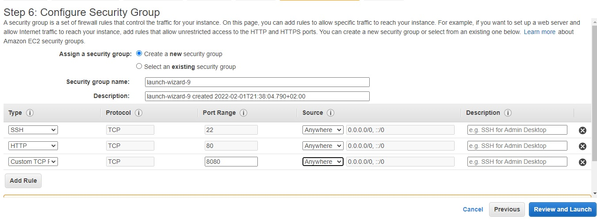
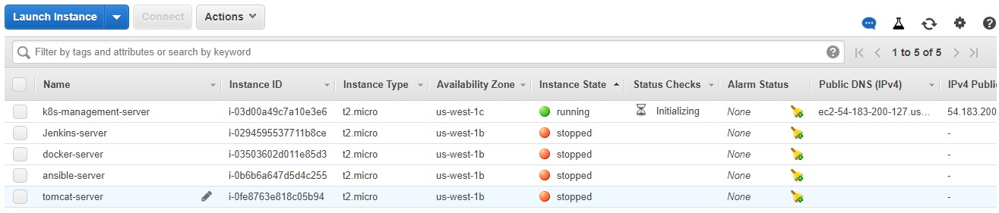
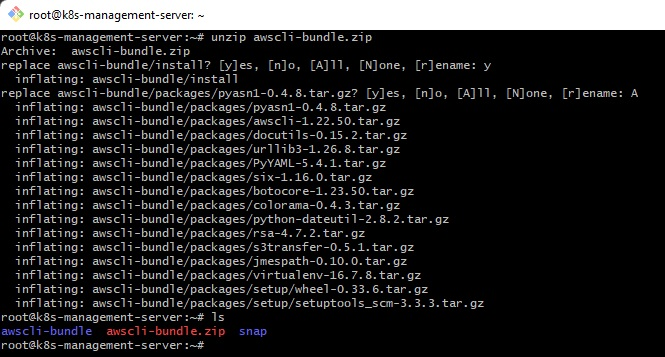
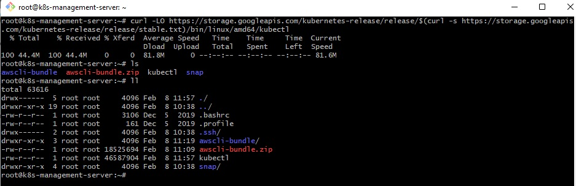
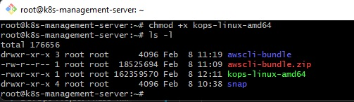
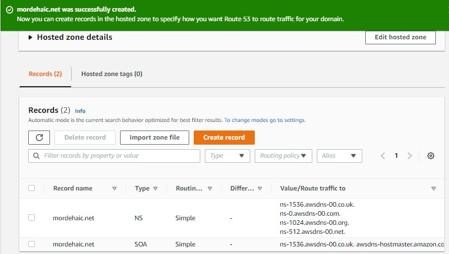
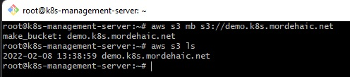
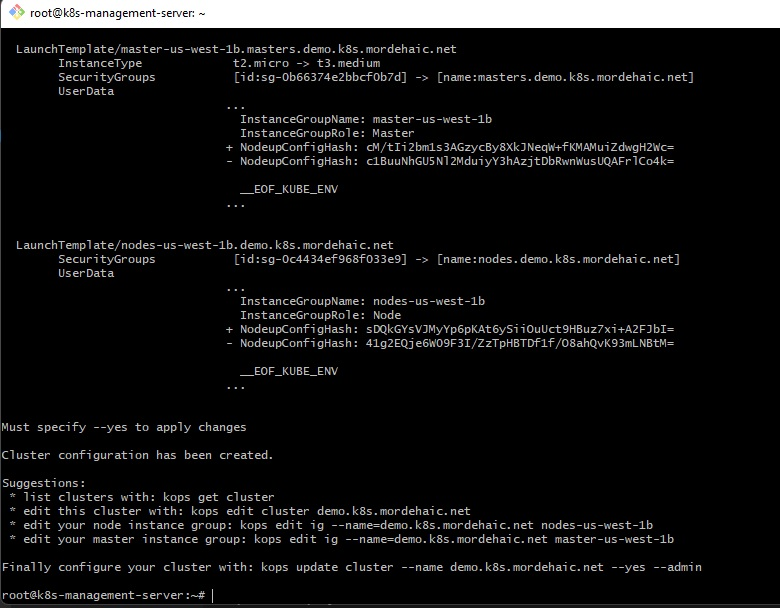
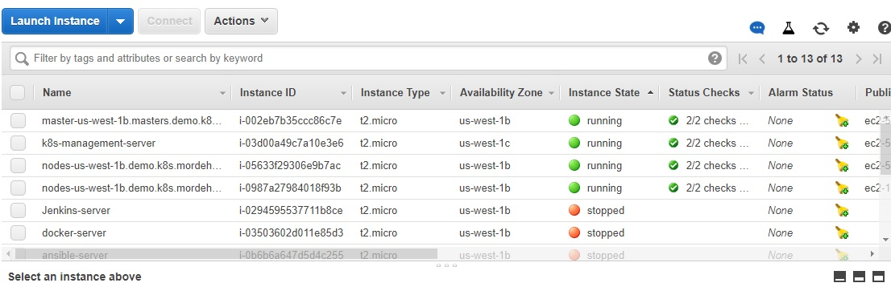

# DevOps Project Phase 5 - Deploy on Kubernetes

  

# A - Kubernetes (K8s) Cluster installation on AWS using Kops

 ### 1. Launch an EC2 instance k8s-management-server
   Uses Ubuntu Server 20.04 LTS AMI (64-bit Arm)

   With internet access

   Security Group with Port '8080' open for internet
   

   AWS EC2 Dashboard
   

### 2. Connect to the k8s management server via Git Bash
    Run the next commands:
        . cd Downloads(directory in which is located the ubuntu-server-20-04.pem file)
        . ssh -i "ubuntu-server-20-04.pem" ubuntu@ec2-54-183-200-127.us-west-1.compute.amazonaws.com
   
    
    Change hostname of the ec2 machine to k8s-manager-server:

        . sudo su -
        . hostname k8s-management-server
        . sudo su -
   

    Run the next command:
        . apt update

### 3. Install AWSCLI
   Download the awscli-bundle.zip file by running the next command:

    . curl https://s3.amazonaws.com/aws-cli/awscli-bundle.zip -o awscli-bundle.zip
    . ls
   

    . unzip awscli-bundle.zip
    . ls
   

    We have to install Python 3.8 because we can't install awscli with Python 2.7 installed on the server.
    Install Python 3.8 using the next command:
      . apt-get install python3.8
      . sudo ln -s /usr/bin/python3.8 /usr/bin/python
      . sudo apt install python3.8-venv
      . ./awscli-bundle/install -i /usr/local/aws -b /usr/local/bin/aws
      . aws --version
   

### 4. Install kubectl on ubuntu instance

    Download kubectl version 1.22.3 (we have to download the same version we will download for kops)running the next command:
    . curl -LO https://dl.k8s.io/release/v1.22.3/bin/linux/amd64/kubectl
    . ls
   

    . chmod +x ./kubectl (give execution permission)
    . ls -l
   

    . sudo mv ./kubectl /usr/local/bin/kubectl
    . ll /usr/local/bin/kubectl
    . kubectl version
   

### 5. Install kops on ubuntu instance

    Kops is a tool that is useful to set up kubernetes cluster on AWS
    Without this tool, we can't talk with our AWS management console
    Run the next command to download the package:
      . curl -LO https://github.com/kubernetes/kops/releases/download/$(curl -s https://api.github.com/repos/kubernetes/kops/releases/latest | grep tag_name | cut -d '"' -f 4)/kops-linux-amd64

      . ll
   

      . chmod +x kops-linux-amd64 (give execution permission)
      . ls -l
   

      . sudo mv kops-linux-amd64 /usr/local/bin/kops
      . ls -l /usr/local/bin/kops
      . kops version
   
   It is important that the version of kubectl(here v1.22.3) is the same as the version of kops(v1.22.3)
   

### 6. Create an IAM user/role with Route53, EC2, IAM and S3 full access

  AWS Console --> Services --> IAM

    Create a role because ubuntu server is sitting on AWS.
    We will attach this role to EC2 next to add permission
   

   ## Choose:
   ### EC2
   ### Allows EC2 instances to call AWS services on your behalf.
   
   ## Add Permission
   ### Click on the button: 
   ### Next: Permissions
    
   ### We need to attach the next permissions policies:
    . AmazonEC2FullAccess
    . AmazonS3FullAccess
    . AmazonRoute53FullAccess
    . IAMFullAccess 
        
   ## Add tags
   ### Click on the Button: 
     Next: Tags

     Key: Name
     Value: k8s-role
   

   ## Review
   ### Click on the Button: 
     Next: Review

     Role name: k8s-role
   
   we can see the policies we have granted

   ### Click the button:
     Create role
   

   ## Attach this role to ec2 instance
   ### Go to ec2 instance console
   

   ### Click to Actions --> Instance Settings --> Attach/Replace IAM Role
   

   ### Click on the Apply button
   

   ### Attach IAM Role to ubuntu ec2 instance (attach to North California(us-west-1) region

   ### Go to the terminal of the k8s-management-server
   ### Run the next command:
     . aws configure
        
     . Set for the Default region name: us-west-1 
   

### 7. Create a Route53 private hosted zone(you can create Public hosted zone if you have a domain)
    Route53 --> DNS management 
    
    Click Create hosted zone button

        Set for Domain Name: mordehaic.net
        Selected Private hosted zone
        Selected Region: us-west-1
        And Choose the VPC ID of the region selected:

    Click on the Create hosted zone button
   

   hosted zone created
   

### 8. Create S3 Bucket

    Create a bucket named "demo.k8s.mordehaic.net" running the next command:
        . aws s3 mb s3://demo.k8s.mordehaic.net
   

   View the Bucket created via the aws console
   

   ### Check if our role is working by running the next command:
     . aws s3 ls
   

   ### It displays:
   ### demo.k8s.mordehaic.net

   We can access S3. This is the bucket we created

### 9. Expose environment variable:
    Run the next command on the terminal:

        . export KOPS_STATE_STORE=s3://demo.k8s.mordehaic.net
   

### 10. Create sshkeys before creating cluster
    Run the next command on the terminal:

        . ssh-keygen

    It's generating public/private rsa key pair that is useful to log into kubernetes cluster
    Without this key, we can't create a cluster
   

### 11. Create kubernetes cluster definitions on S3 bucket
    Run the next command on the terminal:

        . kops create cluster --cloud=aws --zones=us-west-1b --name=demo.k8s.mordehaic.net --dns-zone=mordehaic.net --dns private
    

   

    Run the next command to get cluster:
        . kops get cluster
    

### 12. If you wish to update the cluster worker node sizes
    Run the next command on the terminal to launch smaller instance:
     Edit your node instance group:
        . kops edit ig --name=demo.k8s.mordehaic.net nodes-us-west-1b

     For the machineType, replace t3.medium by t2.micro
     For the maxSize and minSize, replace 1 by 2
   

     Edit your master instance group:   
        . kops edit ig --name=demo.k8s.mordehaic.net master-us-west-1b
    
    For the machineType, replace t3.medium by t2.micro    
        

### 13. Create kubernetes cluster
    Run the next command:

     . kops update cluster --name demo.k8s.mordehaic.net --yes --admin

   

   . Hosted zone details
   

   . Nodes and Master was created
   

### 14. Validate cluster
    Run the next command:

      . kops validate cluster
   

### 15. ssh to the master
    Run the next command:

      . ssh -i ~/ .ssh/id_rsa ubuntu@api.demo.k8s.mordehaic.net
   

### 16. Check kubectl version
    Run the next command:

      . kubectl version
   

### 17. Download kubectl
    Run the next command:
    
      . curl -LO https://storage.googleapis.com/kubernetes-release/release/$(curl -s https://storage.googleapis.com/kubernetes-release/release/stable.txt)/bin/linux/amd64/kubectl

