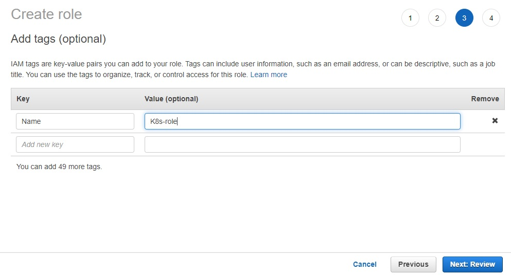
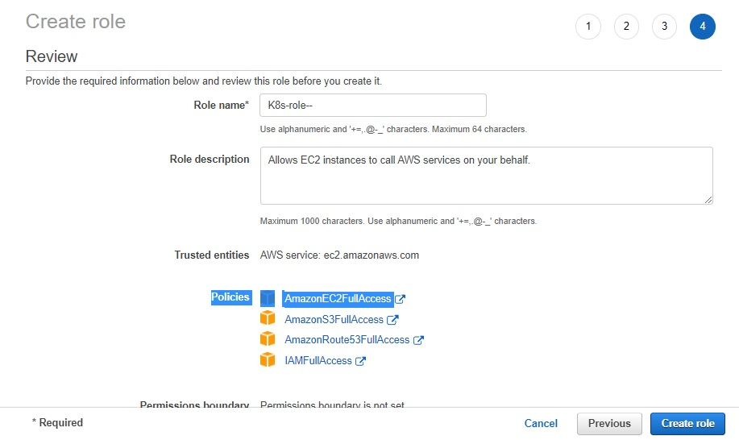
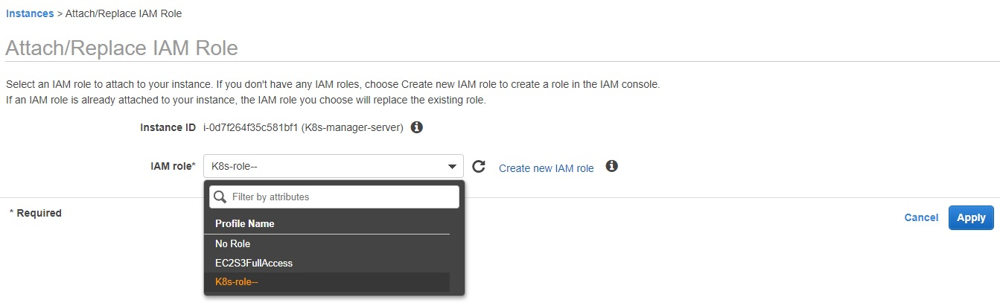
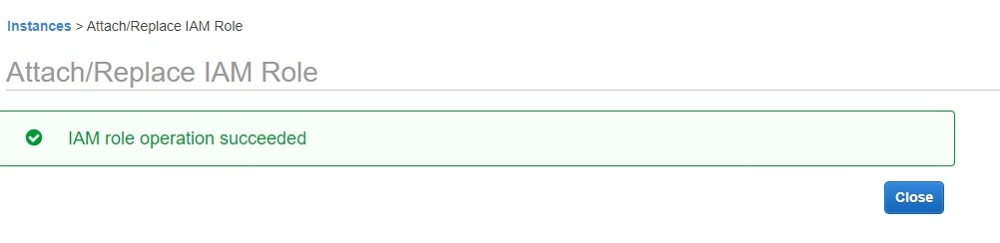
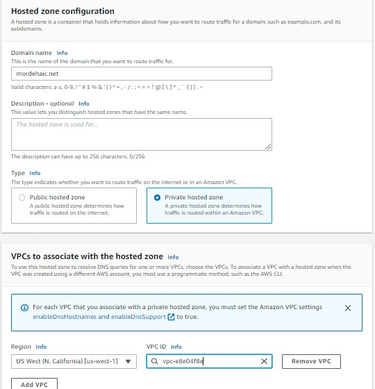
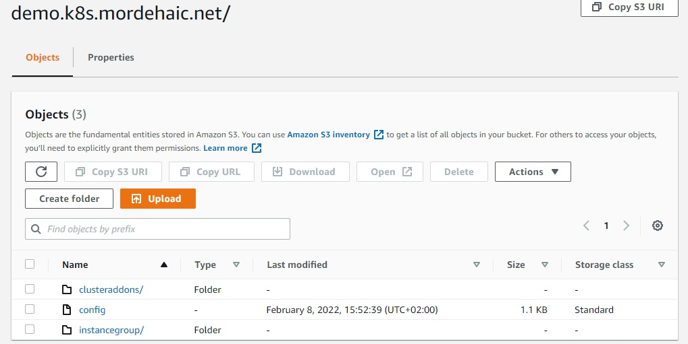
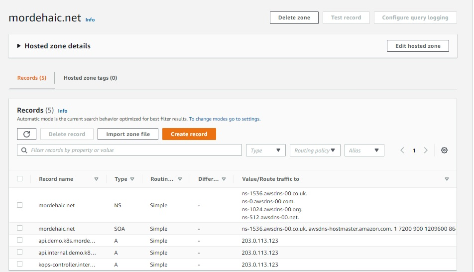

# DevOps Project Phase 5 - Deploy on Kubernetes

  

# A - Setup Kubernetes (K8s) Cluster on AWS

 ### 1. Launch an EC2 instance for eksctl server
   Uses Amazon Linux 2 AMI as for the Jenkins server and the docker server

   With internet access

   Security Group with Port '8080' open for internet
   

   AWS EC2 Dashboard
   

### 2. Connect to the eksctl-server via Putty
   Change hostname of the ec2 machine to k8s-manager-server:

        . sudo su -
        . hostname eksctl-server
        . sudo su -
   

### 3. Install AWSCLI on the eksctl-server
   a. Download python-pip

        Run the next command:
        . yum install python-pip
   

   b. Install awscli

        Run the next command:
        . pip install awscli
       
   aws version
        Run the next command:
            . aws --version
   

 ### 4. Add User on AWS via IAM Service
    
   

    Add User: user-awscli
    
    Select AWS credential type: Selected Access key - Programmatic access
   

   Click on the "Next: Permissions" button

   Attach the next existing policies directly:
    . AmazonEC2FullAccess
    . AmazonS3FullAccess
    . AmazonRoute53FullAccess
    . IAMFullAccess
    . AWSCloudFormationFullAccess
    . AmazonVPCFullAccess
    . AdministratorAccess
   

    Click on the "Next: Tags" button

    Click on the "Next: Review" button
   

   Click on the "Create user" button
   

   Download the user credentials.csv file
   It contains the Access key ID and the Secret access key of the user created

   We will use these key to configure aws

 ### 5. Go to the Powershell prompt
    Run the next command:
        . aws configure

        Set for AWS Access Key: the Access key ID of the credentials.csv file
        Set for AWS Secret Access key: the Secret Access key of the credentials.csv file
        Set for Default region name: us-west-1
   

### 6. Setup kubectl
    a. Download kubectl version 1.21
        Run the next command:
            . curl -o kubectl https://amazon-eks.s3.us-west-2.amazonaws.com/1.21.2/2021-07-05/bin/linux/amd64/kubectl
            . ls
   
      
    b. Grant execution permissions to kubectl executable
        Run the next command:
            . chmod +x ./kubectl
            . ll
   

    c. Move kubectl onto /usr/local/bin
        Run the next command:
            . mv ./kubectl /usr/local/bin
   

    d. Test that your kubectl installation was successful
        Run the next command:
            . kubectl version --short --client
     

### 7. Setup eksctl
    a. Download and extract the latest release
        Run the next commands:
            . curl --silent --location "https://github.com/weaveworks/eksctl/releases/latest/download/eksctl_$(uname -s)_amd64.tar.gz" | tar xz -C /tmp
            . sudo mv /tmp/eksctl /usr/local/bin
            . eksctl version
            . ll /usr/local/bin
   

### 8. Create an IAM user/role with Route53, EC2, IAM and S3 full access

  AWS Console --> Services --> IAM

    Create a role because ubuntu server is sitting on AWS.
    We will attach this role to EC2 next to add permission
   

   ## Choose:
   ### EC2
   ### Allows EC2 instances to call AWS services on your behalf.
   
   ## Add Permission
   ### Click on the button: 
   ### Next: Permissions
    
   ### We need to attach the next permissions policies:
    . AmazonEC2FullAccess
    . AmazonS3FullAccess
    . AmazonRoute53FullAccess
    . IAMFullAccess
    . AWSCloudFormationFullAccess
    . AmazonVPCFullAccess
    . AdministratorAccess
        
   ## Add tags
   ### Click on the Button: 
     Next: Tags

     Key: Name
     Value: K8s-role
   

   ## Review
   ### Click on the Button: 
     Next: Review

     Role name: K8s-role
   
   we can see the policies we have granted

   ### Click the button:
     Create role
   

   ## Attach this role to ec2 instance
   ### Go to ec2 instance console
   

   ### Click to Actions --> Instance Settings --> Attach/Replace IAM Role
   

   ### Click on the Apply button
   

   ### Attach IAM Role to eksctl-server ec2 instance (attach to North California(us-west-1) region

   ### Go to the terminal of the k8s-manager-server
   ### Run the next command:
     . aws configure
        
     . Set for the Default region name: us-west-1 
   

   ### Check if our role is working by running the next command:
     . aws s3 ls
   

   ### It displays: 
   ### demo.k8s.mordehaic.net

   We can access S3. This is the bucket we created

   ### We are going to store our configuration in this bucket and make it emply
   

### 9. Create a Route53 private hosted zone(you can create Public hosted zone if you have a domain)
    Routeh53 --> DNS management 
    
    Click Create hosted zone button

        Set for Domain Name: mordehaic.net
        Selected Private hosted zone
        Selected Region: us-west-1
        And Choose the VPC ID of the region selected:

    Click on the Create hosted zone button
   

   hosted zone created
   

### 10. Create an S3 bucket
    Run the next command on the terminal:

        . aws s3 us-west-1 s3://demo.k8s.mordehaic.net
   

### 11. Create our cluster and nodes
    Command synthax:
        eksctl create cluster --name cluster-name  \
        --region region-name \
        --node-type instance-type \
        --nodes-min 2 \
        --nodes-max 2 \ 
        --zones <AZ-1>,<AZ-2>

        example:
        eksctl create cluster --name mordehaic \
        --region us-west-1 \
        --node-type t2.small 

### 13. Create sshkeys before creating cluster
    Run the next command on the terminal:

        . ssh-keygen

    It's generating public/private rsa key pair that is useful to log into kubernetes cluster
    Without this key, we can't create a cluster
   

### 14. Create kubernetes cluster definitions on S3 bucket
    Run the next command on the terminal:

        . kops create cluster --cloud=aws --zones=us-west-1b --name=demo.k8s.mordehaic.net --dns-zone=mordehaic.net --dns private
    
        
   

### 15. If you wish to update the cluster worker node sizes
    Run the next command on the terminal to launch smaller instance:
     Edit your master instance group:
        . kops edit ig --name=demo.k8s.mordehaic.net master-us-west-1b
   

    For the machineType, replace t3.mediumReplace by t2.micro
   

### 16. Create kubernetes cluster
    Run the next command:

     . kops update cluster --name demo.k8s.mordehaic.net --yes --admin
   

   . Hosted zone details
   

   . Nodes and Master was created
   

### 17. Validate cluster
    Run the next command:

      . kops validate cluster
   

### 18. ssh to the master
    Run the next command:

      . ssh -i ~/ .ssh/id_rsa ubuntu@api.demo.k8s.mordehaic.net
   

### 19. Check kubectl version
    Run the next command:

      . kubectl version
   

### 20. Download kubectl
    Run the next command:
    
      . curl -LO https://storage.googleapis.com/kubernetes-release/release/$(curl -s https://storage.googleapis.com/kubernetes-release/release/stable.txt)/bin/linux/amd64/kubectl

