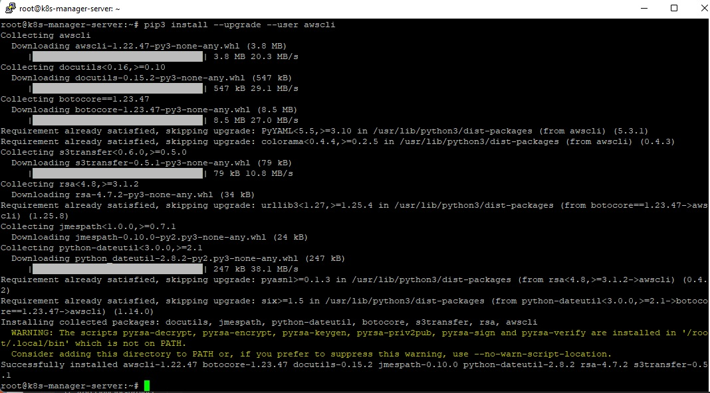
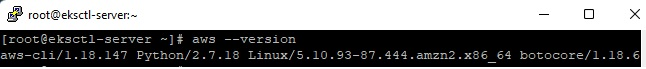
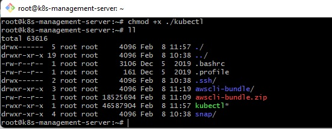
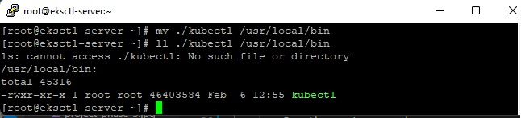
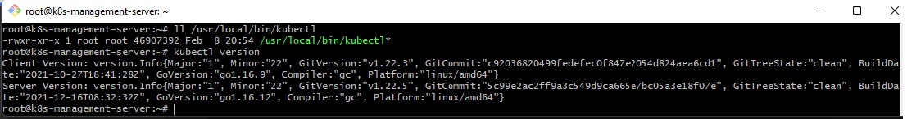
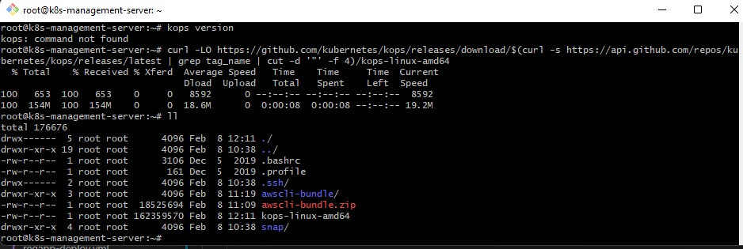

# DevOps Project Phase 5 - Deploy on Kubernetes

  

# A - Setup Kubernetes (K8s) Cluster on AWS

 1. Launch an EC2 instance k8s-manager-server
    uses Amazon Linux 2 AMI as for the Jenkins server and the docker server

    

    With internet access

    Security Group with Port '8080' open for internet
    

    AWS EC2 Dashboard

    

 2. Connect to the K8s-mamager-server via Putty
    
    Change hostname of the ec2 machine to k8s-mamager-server:

        . sudo su -
        . hostname k8s-mamager-server
        . sudo su -
    

 3. Install AWSCLI

        Run the next commands:
        . curl https://s3.amazonaws.com/aws-cli/awscli-bundle.zip -o awscli-bundle.zip
        . ls
    

 4. Install python

        Update the packages list and install the prerequisites:
        . sudo apt update
        . sudo apt install software-properties-common

        Add the deadsnakes PPA to your system’s sources list:
        . sudo add-apt-repository ppa:deadsnakes/ppa

        Once the repository is enabled, you can install Python 3.9 by executing:
        . sudo apt install python3.9
        . apt install python3-pip
        . pip3 install --upgrade --user awscli
    
        
        Ensure the folder that contains aws is part of your PATH variable.
            a. Find your shell's profile script in your user directory. If you're not sure which shell you have, run echo $SHELL.
                . ls -a ~
    

            Add an export command at the end of your profile script that's similar to the following example.
                . export PATH=$HOME/.local/bin:$PATH
                . echo $PATH
            This command inserts the path, $HOME/.local/bin in this example, at the front of the existing $PATHvariable.
    

            Reload the profile into your current session to put those changes into effect.
                . source ~/.profile

 5. Check the awscli version
    
        . aws --version
    

 6. Install kubectl on ubuntu instance
        
        Run the next command:
        . curl -LO https://storage.googleapis.com/kubernetes-release/release/$(curl -s https://storage.googleapis.com/kubernetes-release/release/stable.txt)/bin/linux/amd64/kubectl
    

        . chmod +x ./kubectl (give execution permission)
        . ls -l
    

        . sudo mv ./kubectl /usr/local/bin/kubectl
        . ls -l /usr/local/bin/kubectl
    

 7. Check the kubectl version

        . kubectl version
    

 8. Install kops on ubuntu instance
    
    Kops is a tool that is useful to set up kubernetes cluster on AWS
    Without this tool, we can't talk with our AWS management console
    Run the next command to download the package:
        . curl -LO https://github.com/kubernetes/kops/releases/download/$(curl -s https://api.github.com/repos/kubernetes/kops/releases/latest | grep tag_name | cut -d '"' -f 4)/kops-linux-amd64

        . ls -l
    

        . chmod +x kops-linux-amd64 (give execution permission)
        . ls -l
    

        . sudo mv kops-linux-amd64 /usr/local/bin/kops
        . ls -l /usr/local/bin/kops
    

 9. Create an IAM user/role with Route53, EC2, IAM and S3 full access
